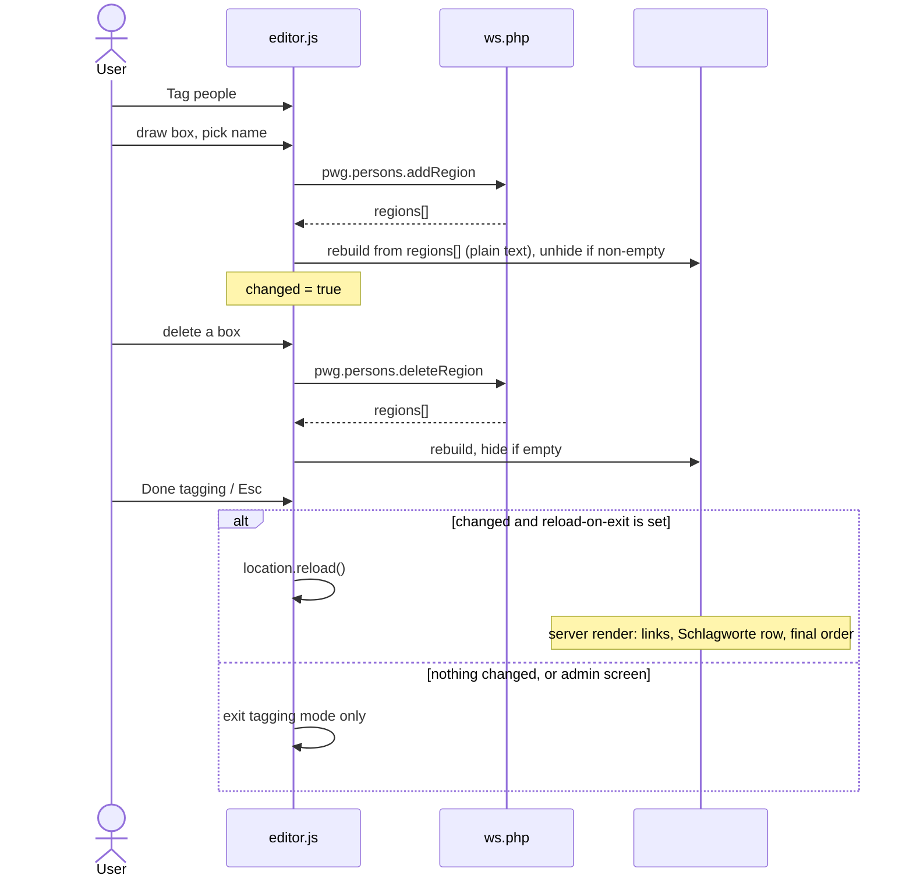

# Persons: show a newly tagged person in the photo info box right away

## Problem

On the public picture page, tagging a person draws the box. The **Personen** row in the photo
info box does not change until the user reloads the page by hand. The **Schlagworte** row has the
same problem, because every person is also an ordinary tag
([decision 0031](../../../docs/agents/decisions/0031-person-names-are-visible-to-guests-as-ordinary-tags.md)).

```
Photo info box (#standard)
├─ Schlagworte  ← core related_tags (themes/default/template/picture.tpl)  → stale after a save
├─ Personen     ← plugins/persons/template/public_persons.tpl              → stale after a save
│                 not rendered at all while the photo has no face
└─ …
```

## Current state

| Piece | Where | Behaviour today |
|---|---|---|
| Save a box | `editor.js` `commit()` → `pwg.persons.addRegion` | `adopt()` turns the draft into a box with a plain-text label |
| Delete a box | `editor.js` → `pwg.persons.deleteRegion` | removes the box only |
| ws response | `ws_functions.inc.php` `persons_regions_payload()` | **both** methods return every region on the photo: `id`, `name`, `type`, `tag_id`, `url_name`, … |
| Personen row | `public_persons.tpl`, data from `persons_assign_overlay()` in `render.inc.php` | Face regions only, one entry per name, in region-id order, linked through `persons_person_gallery_url()` (`make_index_url()`) |
| Row switch | `$display_info.persons`, added by `maintain.class.php` `add_display_info_key()` | an admin can turn the row off |
| Surfaces | public prefilter (`events_public.inc.php`) and admin tagging screen (`admin_photo.tpl`) | both load the same `editor.js`. The admin screen has no info box |

## Target behaviour



## Key Decisions

### Live patch while tagging, one reload on exit

- **Decision:** Hybrid (option D). Patch the Personen row in the browser after every successful
  add or delete. Reload the page once when the user leaves tagging mode.
- **Reason:** The name shows up at once and tagging mode stays open while several faces are
  tagged in a row. The single reload brings everything else up to date (links, the Schlagworte
  row) without a second copy of core's markup.
- **Trade-offs:** Rejected: a full reload after every save (A), which leaves tagging mode on every
  face and loses the scroll position. Rejected: a pure client patch (B), which never fixes
  Schlagworte. Rejected: a server-rendered fragment (C), which needs new ws output and cannot
  cleanly own core's tag row.

### The empty row container is always emitted

- **Decision:** `public_persons.tpl` emits `#Persons` whenever `$display_info.persons` is on. The
  element is `hidden` while the photo has no face. JS fills it and unhides it. If the row is
  switched off, or the visitor is a guest, nothing is emitted and JS does nothing.
- **Reason:** The first face on a photo needs a row to patch. The markup stays in one place, the
  template.
- **Trade-offs:** Rejected: JS builds the whole `<div class="imageInfo">`. That is a second copy
  of the markup and has to guess where in the info list it goes.

### Plain-text names in the live row

- **Decision:** While tagging, names in the row are plain text. The links come back with the exit
  reload.
- **Reason:** URLs come from `make_index_url()` on the server. `adopt()` already labels new boxes
  as plain text for the same reason. No second URL builder in JS.
- **Trade-offs:** Links are missing until exit. Rejected: a server-built `url` field in
  `persons_regions_payload()`, which changes the ws contract for a state that lasts only until
  "Done".

### Rebuild the row from the returned region list

- **Decision:** After each add or delete, rebuild the row from `data.result.regions`: `type ===
  'Face'` only, one entry per name, in region-id order. This is the same rule as
  `persons_assign_overlay()`.
- **Reason:** Both ws methods already return the full list, so add, delete and duplicate names
  are handled by one code path. The row before the reload and the row after it match.
- **Trade-offs:** The selection rule now exists in PHP and in JS. Both copies are small, and the
  E2E check "row after reload equals row before reload" catches drift. Rejected: appending or
  removing single names, which goes wrong on duplicates and on delete.

### Delete updates the row too

- **Decision:** A successful delete rebuilds the row. Removing the last face hides it again.
- **Reason:** Symmetric with add. A name that stays visible after its box is gone is the same
  bug.
- **Trade-offs:** None worth recording.

### Reload only on the public page, only after a change

- **Decision:** Leaving tagging mode ("Done tagging" or Esc with no open draft) reloads the page
  only when at least one add or delete succeeded since entering the mode. The trigger is a
  `data-persons-reload-on-exit` attribute on `#persons-editor`, set only on the public page.
- **Reason:** The admin tagging screen has no info box, so a reload there gains nothing.
  `editor.js` must stay unaware of which page it is on (comment in `admin_photo.tpl`). A data
  attribute keeps that rule.
- **Trade-offs:** The attribute is one more piece of configuration on the editor element.
  Rejected: always reloading on exit, which reloads for nothing when the user only looked.

### Schlagworte is fixed by the reload, not patched

- **Decision:** The core tag row is left alone while tagging. The exit reload updates it.
- **Reason:** The row is core markup (`related_tags`). Patching it from plugin JS would depend on
  core's DOM structure. Decision 0031 also records that this project avoids persons-aware changes
  to core's tag rendering.
- **Trade-offs:** The new tag appears under Schlagworte only after "Done".

## Tests

Placement follows [testing.md](../../../.claude/rules/testing.md). Case tags follow
[test-design.md](../../../.claude/rules/test-design.md).

0. **Characterize first** (`testing.md`, "Cover the ground before you move it"): the current row
   content, and the fact that "Done" does not reload. Commit these on their own before the change.
1. **Integration**, `plugins/persons/tests/Integration/PicturePageSourceTest.php`:
   - `[ECP]` a photo with no face has a hidden, empty `#Persons`
   - `[NEG]` with `display_info.persons` off, `#Persons` is absent
   - `[NEG]` a guest gets no `#Persons` (extends `testAGuestSeesNoOverlay`)
   - `[HAPPY]` `data-persons-reload-on-exit` is on the public editor element
   - `[NEG]` the attribute is absent on the admin tagging screen
2. **E2E**, `plugins/persons/tests/e2e/editor.spec.js` (locators in `support/PicturePage.js`):
   - `[HAPPY]` a saved name appears in `#Persons` with no navigation
   - `[BVA]` the first face on an empty photo unhides the row; deleting the last face hides it
   - `[ECP]` a second box with the same name does not list the name twice
   - `[ST]` "Done" after a change reloads; the row then has links and Schlagworte has the tag
   - `[ST]` "Done" with no change does not reload
   - `[ECP]` the row before the reload equals the row after it (catches drift between the PHP and
     JS rules)
3. **Unit:** not applicable. No PHP logic changes, and the JS has no unit layer in this plugin.

Navigation is detected through Playwright's `page.waitForEvent('load')` or by watching for a new
navigation, never through a timeout ([test-design.md](../../../.claude/rules/test-design.md),
"Assert the causal fact").

## Files touched

| File | Change |
|---|---|
| `plugins/persons/template/public_persons.tpl` | always emit `#Persons` when the row is on; `hidden` while empty |
| `plugins/persons/template/public_overlay.tpl` | `data-persons-reload-on-exit` on `#persons-editor`, public page only |
| `plugins/persons/include/events_public.inc.php` / `render.inc.php` | assign the flag that the attribute reads |
| `plugins/persons/template/editor.js` | rebuild the row after add and delete; track `changed`; reload in `exit()` |
| `plugins/persons/tests/…` | tests above |
| `handbuch/05-personen.html` | check whether the text describes the old behaviour ([handbook.md](../../../.claude/rules/handbook.md)) |

Branch: `fix/persons-live-row` off `master` ([git-and-commits.md](../../../.claude/rules/git-and-commits.md)).
