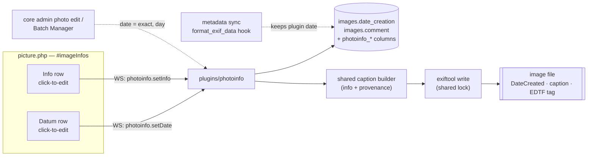

# Photo date and info text

Two fields per photo, edited in place on the picture page inside `<div id="imageInfos">` and
written into the image file:

- **Datum**: an exact or partial date ("1965", "März 1965", "14. März 1965"), optionally
  qualified (`ca.`, `vor`, `nach`) or given as a range (`1965–1970`)
- **Info**: a free-text description, edited in a textarea

Most photos in this install are recovered family scans
([research](../../../docs/agents/research/2026-08-29-recovered-scans.md)). Nobody knows the exact
day most of them were taken, so a date picker that requires a full day is the wrong tool.

## What exists today

| Field | Lives in | On the picture page | In the file |
|---|---|---|---|
| `images.date_creation` (`DATETIME`) | core | "Erstellt am" row in `<dl id="standard">` | **read** from EXIF `DateTimeOriginal` on metadata sync (`$conf['use_exif_mapping']`) |
| `images.comment` | core | above the photo (`COMMENT_IMG`, `picture.php:830`) | not written |
| `images.provenance_note` + inherited fields | `plugins/provenance` | "Provenienz" row | composed caption in `EXIF:ImageDescription`, `XMP-dc:Description`, `IPTC:Caption-Abstract` (`plugins/provenance/include/functions.inc.php:200-243`) |

Background: the provenance write-back research
[`docs/agents/research/2026-08-29-per-photo-freetext-field-and-metadata-writeback.md`](../../../docs/agents/research/2026-08-29-per-photo-freetext-field-and-metadata-writeback.md)
(exiftool capability, the round-trip risk in section B, locking, the shared-hosting probe).

## Overview



## Date model

Core's `date_creation` keeps the **start** date, so the calendar, sorting and date search keep
working without changes. Plugin columns on `images` carry what `DATETIME` cannot:

| Column | Type | Meaning |
|---|---|---|
| `date_creation` (core) | `DATETIME` | start date; unknown parts set to `01` |
| `photoinfo_date_qualifier` | ENUM(`circa`,`before`,`after`,`between`), NULL | NULL = exact |
| `photoinfo_date_precision` | ENUM(`year`,`month`,`day`) | precision of the start |
| `photoinfo_date_end` | `DATE`, NULL | range end, only with `between` |
| `photoinfo_date_end_precision` | ENUM(`year`,`month`,`day`), NULL | precision of the end |

Allowed combinations:

| Qualifier | Second date | Shown as | EDTF (custom XMP tag) |
|---|---|---|---|
| — (exact) | no | `14. März 1965` / `März 1965` / `1965` | `1965-03-14` / `1965-03` / `1965` |
| `ca.` | no | `ca. 1965` | `1965~` |
| `vor` | no | `vor 1965` | `../1965` |
| `nach` | no | `nach März 1965` | `1965-03/..` |
| `zwischen` | yes | `1965–1970` | `1965/1970` |

EDTF: [Library of Congress, Extended Date/Time Format](https://www.loc.gov/standards/datetime/)
(ISO 8601-2).

## UI

```
Datum   [ — ▾ ] [1965] [März ▾] [– ▾]        qualifier: — | ca. | vor | nach | zwischen
        └ only with "zwischen":  bis [1970] [— ▾] [— ▾]

Info    ┌────────────────────────────────┐
        │ textarea                        │
        └────────────────────────────────┘
```

- Both rows read-only by default; an administrator clicks a row to edit it, and each row saves
  on its own
- Year: 4-digit numeric field (`inputmode="numeric"`), 1800 to the current year
- Month: dropdown of German month names, `—` for unknown; disabled while the year is empty
- Day: dropdown, disabled until a month is chosen; its options follow the month and leap years
- A range end before its start is refused
- Empty fields are allowed. Clearing the date removes it from the database and the file

## Key Decisions

### Store the date in core's column plus plugin columns

- **Decision:** `date_creation` holds the start date; qualifier, precision and range end live in
  new plugin columns on `images`.
- **Reason:** calendar view, sorting and search keep working; only what `DATETIME` cannot hold
  is added.
- **Trade-offs:** core screens that show `date_creation` show the start date with `01` for
  unknown parts. Rejected: separate plugin-only columns (no calendar/sorting); one EDTF string
  column (needs parsing to sort); free text (no structure).

### Info text is core's `comment`

- **Decision:** the info text is the photo's description, `images.comment`.
- **Reason:** one description per photo; core search and other screens already use it.
- **Trade-offs:** core renders `comment` with `pwg_nl2br` and allows HTML from administrators; the
  new row must render it the same way. Rejected: reusing `provenance_note` (ties info text to
  provenance's meaning and history); a second plugin text column (two descriptions).

### Qualifier and range as one select, with no "genau" option

- **Decision:** one select `— | ca. | vor | nach | zwischen`; the empty option means exact. Only
  `zwischen` shows the second date. `ca.` does not combine with a range.
- **Reason:** one control, one meaning per state; the common case (exact) needs no click.
- **Trade-offs:** "ca. 1965–1970" cannot be expressed. Rejected: `ca.` on ranges; year-only
  ranges.

### Year as a numeric field, month and day as dropdowns

- **Decision:** 4-digit year input, month and day dropdowns, dependent enabling.
- **Reason:** a year dropdown spanning 1800 to today has over 200 entries; a numeric field
  opens the number keypad on phones. Dependent enabling makes "day without month" impossible.
- **Trade-offs:** typed years need validation. Rejected: three dropdowns; one free-text field
  with a parser.

### Year bounds 1800 to the current year

- **Decision:** 1800 ≤ year ≤ current year; no future dates; range end ≥ start.
- **Reason:** covers every photographic process; catches typos like `1065` and `2065`.
- **Trade-offs:** none relevant for this collection.

### German display format

- **Decision:** `14. März 1965`, `März 1965`, `1965`, `ca. 1965`, `vor 1965`, `nach März 1965`,
  `1965–1970` (en dash).
- **Reason:** reads naturally in German; one formatter serves the page and the caption.
- **Trade-offs:** rejected numeric `14.03.1965` and "zwischen 1965 und 1970" in words.

### Click-to-edit per field, administrators only

- **Decision:** each row is click-to-edit and saves on its own; edit rights for `is_admin()`.
- **Reason:** editing one field does not disturb the other; matches provenance's permission
  model.
- **Trade-offs:** every save is one exiftool write. Rejected: one "Bearbeiten" button for both
  rows; permanently visible form fields; any logged-in user (typetags,
  [decision 0005](../../../docs/agents/decisions/0005-tag-assignment-permission-model.md));
  webmaster only (photoedit).

### Replace core's rows, move the description into the panel

- **Decision:** the new date row replaces "Erstellt am"; the description is no longer shown
  above the photo, only in `#imageInfos`.
- **Reason:** nothing appears twice, and both fields sit next to each other as requested.
- **Trade-offs:** a fork-local change to where core shows the description; done by prefilter
  ([decision 0036](../../../docs/agents/decisions/0036-prefilters-include-plugin-templates.md)),
  not by editing `picture.tpl`.

### One composed caption for info and provenance

- **Decision:** the standard caption slots (`XMP-dc:Description`, `IPTC:Caption-Abstract`,
  `EXIF:ImageDescription`) hold the info text, a blank line, then the provenance text. One shared
  builder composes it; a save in either plugin rebuilds it.
- **Reason:** every photo program shows the standard caption; both texts stay visible there and
  one writer cannot erase the other's text.
- **Trade-offs:** provenance's caption code moves to shared code that both plugins load, and
  provenance's tested write-back must be covered as it is before moving. Rejected: provenance
  moving to its own XMP tag only; info text in a custom tag only.

### Date tags in the file

- **Decision:** `XMP-photoshop:DateCreated` and `IPTC:DateCreated` carry the start date at its
  precision (IPTC uses `00` for unknown month or day). A custom XMP tag carries the EDTF string.
  The readable date ("ca. 1965") is part of the composed caption.
- **Reason:** `DateCreated` is the MWG slot for "when the content was created" (research,
  "MWG guidance") and accepts partial dates; EDTF keeps qualifier and range lossless.
- **Trade-offs:** standard tools only see the start date. Rejected: `DateCreated` alone (loses
  qualifier and range); caption text only.

### Never write `DateTimeOriginal`; protect the date on re-sync

- **Decision:** the plugin never writes EXIF `DateTimeOriginal`. A `format_exif_data` hook
  (`include/functions_metadata.inc.php:138-146`) keeps the plugin's date when a metadata sync runs
  for a photo that has one, and drops `DateTimeOriginal` for a file without camera metadata (see
  next decision).
- **Reason:** on scans `DateTimeOriginal` is the scan date, and a full timestamp cannot express
  "1965". Without the hook a sync overwrites `date_creation` with the scan date.
- **Trade-offs:** the hook receives a file name, not an image id, so it must map path to row.
  Rejected: removing `date_creation` from `use_exif_mapping` (silently changes behaviour for
  photos taken by cameras); accepting the overwrite.

### A file's own date counts only with camera metadata

- **Decision:** a date read from the file (`DateTimeOriginal` on metadata sync) is used only when
  the file also carries camera metadata (`EXIF:Make` or `EXIF:Model`). It is then taken as exact,
  precision `day`. Without camera metadata the date is ignored and the field stays empty. The
  filesystem date (mtime, creation time) is never used.
- **Reason:** on a scan of a paper print every file date is the scan date, which is wrong by
  decades. A file with `Make`/`Model` came from a phone or a digital camera, where the date is
  the capture date.
- **Trade-offs:** a scanner that writes `Make`/`Model` would pass the check; a camera image with
  stripped metadata loses its date. Measured 2026-10-07 with exiftool over `galleries/`: 0 of 105
  files carry `Make`, `Model`, `Software` or `DateTimeOriginal`, so no existing photo is affected.

### Core admin screens set an exact date

- **Decision:** a date saved through core's photo edit screen or the Batch Manager counts as
  exact, precision `day`, and is written to the file.
- **Reason:** keeps database, plugin columns and file in agreement whichever screen was used.
- **Trade-offs:** needs hooks on core's save paths. Rejected: hiding core's date field; letting
  them drift.

### A new plugin `plugins/photoinfo`

- **Decision:** a new fork-local plugin, tracked like the others (own `!` entry in `.gitignore`).
  It shares the exiftool lock and the caption builder with provenance.
- **Reason:** same reasoning as
  [decision 0014](../../../docs/agents/decisions/0014-provenance-is-its-own-plugin.md): what a
  photo shows is not where its scan came from.
- **Trade-offs:** a shared piece of code between two plugins, plus a fifth test suite. Rejected:
  extending provenance; changing core.

### photoinfo requires provenance and reuses its writer

- **Decision:** photoinfo refuses to activate without provenance. It reuses
  `provenance_exiftool_run()` (with a new optional exiftool config parameter),
  `provenance_lock_acquire()` and `provenance_caption_tags()`. Provenance gets one filter,
  `trigger_change('provenance_caption_parts', $parts, $image)`, through which photoinfo puts its
  part (info text and readable date) first in every caption provenance writes.

  ```
  photoinfo ──requires──► provenance
     │                      ├─ provenance_exiftool_run(argfile, file, path, config)
     │                      ├─ provenance_lock_acquire()   (also taken on photoedit_begin)
     │                      └─ provenance_caption_tags()   (the 5 caption slots)
     └─ handles provenance_caption_parts
  ```
- **Reason:** one lock file per image. Two plugins with separate locks would let concurrent
  exiftool writes run, and those destroy the file (research, "Concurrency and Locking on
  Originals"). One slot list and one composer stay the single source of truth. Photoedit's lock is
  covered without new code.
- **Trade-offs:** photoinfo cannot run alone. Rejected: no dependency with begin/end events (two
  locks to keep in step, the slot list twice); a shared library outside both plugins (a new place
  to deploy and to `.gitignore`).

### The file carries photoinfo's values separately, and a rescan rebuilds them

- **Decision:** besides the composed caption and `DateCreated`, photoinfo writes
  `XMP-pwginfo:Info` (the info text alone) and `XMP-pwginfo:DateEDTF`, declared in its own
  exiftool config. `pwg.photoinfo.rescan` rebuilds the database from these two tags.
- **Reason:** the database is never deployed
  ([decision 0023](../../../docs/agents/decisions/0023-no-database-transfer-to-the-remote.md)), and
  the info text cannot be cut back out of a composed caption. Same pattern as `pwg.persons.rescan`
  ([decision 0020](../../../docs/agents/decisions/0020-persons-index-is-derived-the-file-is-the-source-of-truth.md)).
- **Trade-offs:** the info text is stored twice in the file. Rejected: EDTF tag only; no rebuild.

### Core description edits rewrite the caption

- **Decision:** a description changed in core's photo edit screen or Batch Manager rewrites the
  composed caption in the file, like a date change there.
- **Reason:** the file never disagrees with the database, whichever screen was used.
- **Trade-offs:** more core save paths to hook. Rejected: letting them drift; hiding the field.

### photoinfo is activated on the remote

- **Decision:** `photoinfo` joins `PLUGINS_TO_ACTIVATE` in `tools/deploy/pwgdeploy/bootstrap.py`,
  after `provenance`.
- **Reason:** same as provenance; the remote shows the fields after `pwg.photoinfo.rescan`.
- **Trade-offs:** an edit made on the remote changes a file a later deploy overwrites
  ([decision 0026](../../../docs/agents/decisions/0026-tracked-gallery-photos-are-prune-eligible.md)),
  the same as for provenance.

### No change history in v1

- **Decision:** no history table; core's activity log only.
- **Reason:** follows [decision 0016](../../../docs/agents/decisions/0016-no-history-retention-in-v1.md).
- **Trade-offs:** an overwritten info text cannot be recovered except from the `_original`
  sidecar or git (`galleries/`).

### No mandatory fields

- **Decision:** both fields are optional.
- **Reason:** many scans have neither a known date nor a text.

## Open points for research and planning

- **Provenance coverage first:** provenance's write-back must be covered as it is now before the
  filter goes in ([testing.md, "Cover the ground before you move it"](../../../.claude/rules/testing.md)).
- **PNG and HEIC:** PHP cannot read EXIF back from PNG or HEIC (research, Result 3). Check how
  the `format_exif_data` hook behaves for those files.
- **Photoedit lock:** photoedit fires `photoedit_begin`/`_end`; photoinfo writes must respect them
  as provenance does (`plugins/provenance/include/events_photoedit.inc.php`).
- **Handbook:** `handbuch/` needs a page or section for the new fields and screenshots of the demo
  album ([handbook.md](../../../.claude/rules/handbook.md)).
